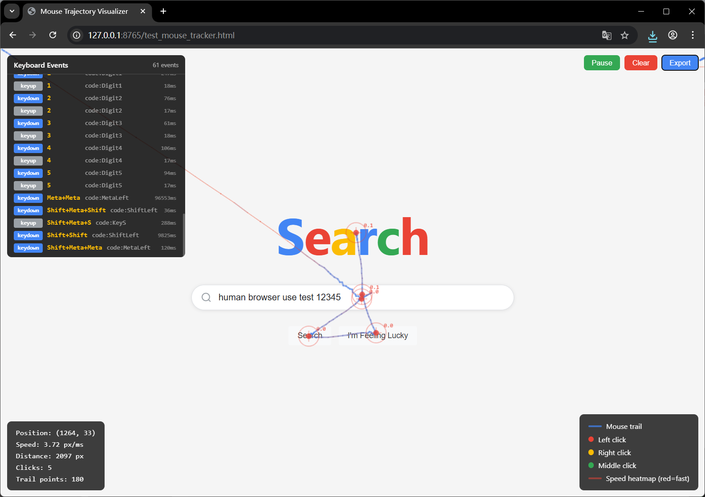

<div align="center">

# 🧬 human-browser-use

### ブラウザ自動化を本物の人間と見分けがつかなくする。

[browser-use](https://github.com/browser-use/browser-use) の拡張で、ロボット的な瞬間操作を本物の人間の動きに置き換えます — 滑らかなマウスカーブ、自然なタイピングリズム、慣性スクロール、フィンガープリント偽装。

**[English](README.md)** · **[中文](README_zh.md)** · **[日本語](README_ja.md)**

</div>

---

<div align="center">

🖱️ ベジエマウス軌跡 &emsp; ⌨️ 対数正規タイピング &emsp; 📜 慣性スクロール &emsp; 🛡️ ステルスフィンガープリント

</div>

<br/>

<div align="center">

</div>

<br/>

# 🤖 LLM クイックスタート

1. お気に入りのコーディングエージェント（Cursor、Claude Code など）を [skill.md](https://github.com/andyless/human-browser-use/blob/master/skill.md) に向ける
2. プロンプトを打つだけ！

<br/>

# 👋 手動クイックスタート

**1. [uv](https://docs.astral.sh/uv/) または pip でインストール（Python >= 3.11）：**

```bash
# uv で（推奨）
uv init && uv add human-browser-use && uv sync

# または pip で
pip install human-browser-use
```

> Chromium がない場合、インストール後に `playwright install chromium` を実行。

**2. 最初の人間らしい自動化を実行：**

```python
import asyncio
from human_browser_use import HumanBrowserSession, HumanBrowserProfile, HumanBehaviorConfig

async def main():
    session = HumanBrowserSession(
        human_config=HumanBehaviorConfig(),
        browser_profile=HumanBrowserProfile(headless=False),
    )
    await session.start()
    await session.navigate_to("https://example.com")

    page = await session.get_current_page()
    inputs = await page.get_elements_by_css_selector("input")
    await inputs[0].click()              # 滑らかなベジエマウス軌跡
    await inputs[0].fill("hello world")  # 自然なタイピングリズム（タイプミスあり）
    await page.press("Enter")

    await session.reset()

asyncio.run(main())
```

これだけです。すべての `click()`、`fill()`、`scroll()` が本物の人間のように動きます。

<br/>

# 🤖 browser-use Agent との併用

`HumanBrowserSession` を Agent に渡すだけ — Agent が自動的に人間らしい動作を獲得：

```python
from browser_use import Agent
from langchain_openai import ChatOpenAI
from human_browser_use import HumanBrowserSession, HumanBrowserProfile, HumanBehaviorConfig

async def main():
    agent = Agent(
        task="Google で 'browser automation' を検索して最初の結果をクリック",
        llm=ChatOpenAI(model="gpt-4o"),
        browser_session=HumanBrowserSession(
            human_config=HumanBehaviorConfig(),
            browser_profile=HumanBrowserProfile(headless=False),
        ),
    )
    await agent.run()

asyncio.run(main())
```

<br/>

# 🧩 Claude Code スキル

スキルファイルをインストールして、Claude Code に human-browser-use の使い方を教える：

```bash
mkdir -p ~/.claude/skills/human-browser-use
curl -o ~/.claude/skills/human-browser-use/SKILL.md \
  https://raw.githubusercontent.com/andyless/human-browser-use/main/skill.md
```

Claude Code に「*human-browser-use を使ってこのページのフォームを入力して*」と伝えるだけで、自動的にコードを書いてくれます。

<br/>

# 🐾 OpenClaw との併用

[OpenClaw](https://github.com/anthropics/openclaw) は任意の `BrowserSession` を受け入れます。`HumanBrowserSession` を渡せば、すべてのブラウザ操作が人間らしくなります：

```python
from human_browser_use import HumanBrowserSession, HumanBrowserProfile, HumanBehaviorConfig

session = HumanBrowserSession(
    human_config=HumanBehaviorConfig(),
    browser_profile=HumanBrowserProfile(headless=False),
)
# セッションを OpenClaw エージェントに渡す — 完了。
```

<br/>

# デモ

### 🖱️ マウス軌跡ビジュアライゼーション

テストページは自動化が発行するすべてのマウスイベントをキャプチャします。青から赤の軌跡は速度を表し（青=遅い、赤=速い）、十字マーカーはクリック位置を示します。

**自分で試す：**

```bash
# ターミナル 1: テストページサーバーを起動
python -m http.server 8765

# ターミナル 2: 自動化テストを実行
python test_tracker.py
```

<br/>

# ⚙️ 設定

すべての動作を個別に設定・切替可能：

```python
config = HumanBehaviorConfig()

# --- マウス ---
config.mouse.overshoot_probability = 0.15       # オーバーシュート確率（長距離で自動増加）
config.mouse.click_offset_sigma = 3.0           # クリック位置のランダム偏差 (px)
config.mouse.press_duration_range = (0.05, 0.15) # ボタン押下時間 (秒)

# --- キーボード ---
config.keyboard.delay_mu = 4.17                 # 対数正規平均 → 約65ms平均キー間隔
config.keyboard.typo_probability = 0.02          # キー入力ごとのタイプミス確率
config.keyboard.common_bigram_factor = 0.7       # "th"、"er" 等の一般ペアが30%高速

# --- スクロール ---
config.scroll.impulse_delta_range = (80, 200)    # 初期スクロールインパルス (px)
config.scroll.inertia_decay = 0.85               # フレームごとの速度減衰

# --- タイミング ---
config.timing.pre_action_delay_range = (0.1, 0.3) # アクション前の思考時間 (秒)

# --- 機能トグル ---
config.enable_stealth = True            # ステルス JS 注入
config.enable_human_mouse = True        # 人間らしいマウス
config.enable_human_keyboard = True     # 人間らしいキーボード
config.enable_human_scroll = True       # 人間らしいスクロール
```

<br/>

# FAQ

<details>
<summary><b>browser-use との違いは？</b></summary>

[browser-use](https://github.com/browser-use/browser-use) はコアのブラウザ自動化フレームワークです。human-browser-use はその上に人間らしい動作レイヤーを追加する拡張です。browser-use は引き続き使用します — 動きを本物の人間のようにするだけです。

- `BrowserSession` → 瞬間クリック、瞬間入力、マウス移動なし
- `HumanBrowserSession` → ベジエ軌跡、対数正規タイピング、慣性スクロール、ステルス JS
</details>

<details>
<summary><b>どの LLM でも使える？</b></summary>

はい。human-browser-use は LLM レイヤーに触れません。ブラウザがアクションを実行する方法だけを変更します。GPT-4o、Claude、Gemini、Ollama — browser-use がサポートするものなら何でも使えます。
</details>

<details>
<summary><b>すべてのアンチボット検出を回避できる？</b></summary>

検出のハードルを大幅に引き上げます。ステルスレイヤーは一般的な自動化フィンガープリント（`navigator.webdriver`、WebGL、Canvas、Chrome ランタイム）を隠し、動作レイヤーは DOM レベルのマウス/キーボードイベントを生成します。ただし、100% を保証するツールはありません — 高度なシステムは IP 評判やセッションパターンなども確認します。
</details>

<details>
<summary><b>LLM なしで使える（直接 API）？</b></summary>

はい！上記のクイックスタートをご覧ください。`page.get_elements_by_css_selector()`、`.click()`、`.fill()` などで手動オーケストレーションできます。LLM は不要です。
</details>

<details>
<summary><b>マウス軌跡の仕組みは？</b></summary>

単一の連続ベジエ曲線、弧長パラメータ化による可変速度リサンプリング：
- **0–5%**：急速な加速（0.3x → 2.5x 平均速度）
- **5–75%**：高速巡航 2.3–2.5x、微小な正弦波変動
- **75–100%**：3次イーズアウト減速（2.5x → 0.3x）
- 終端サブピクセルドリフト（sigma 0.3–1.5px）— 手の自然な揺れ
- 所要時間はフィッツの法則：`0.05 + 0.07 * log2(1 + distance/20)` 秒
</details>

<details>
<summary><b>キーボードシミュレーションの仕組みは？</b></summary>

- **キー間隔**：対数正規分布（μ=4.17, σ=0.3 → 平均約65ms）
- **バイグラム加速**："th"、"er" などの一般的なペアは30%高速
- **タイプミス**：2%の確率 → 隣接キーを間違って押す → 停止 → バックスペース → 正しいキー
- **単語境界**：スペース後に追加の80–160ms
</details>

<details>
<summary><b>どんなステルス機能がある？</b></summary>

ページロード時に注入される JS：
- `navigator.webdriver` → `undefined`
- `navigator.plugins` の模倣（Chrome PDF Plugin など）
- WebGL ベンダー/レンダラー偽装（ANGLE 文字列）
- Canvas フィンガープリントノイズ
- `window.chrome.runtime` の存在
- Permissions API レスポンス偽装
- 20 以上の Chrome 起動フラグで検出面を削減
</details>

<br/>

# アーキテクチャ

```
human_browser_use/
├── session.py                  # HumanBrowserSession — メインエントリーポイント
├── profile.py                  # HumanBrowserProfile — ステルス Chrome フラグ
├── config.py                   # 全設定クラス
├── actor/
│   ├── page.py                 # HumanPage — 要素を HumanElement にラップ
│   ├── element.py              # HumanElement — 人間らしい click/fill
│   └── mouse.py                # HumanMouse — 低レベルマウス操作
├── behavior/
│   ├── mouse_trajectory.py     # ベジエ曲線＋可変速度リサンプリング
│   ├── keyboard_dynamics.py    # 対数正規遅延＋タイプミスシミュレーション
│   ├── scroll_dynamics.py      # インパルス-慣性スクロール物理
│   └── timing.py               # アクション前遅延
├── stealth/
│   ├── injection.py            # StealthInjector — JS コンパイル＆注入
│   └── scripts/                # navigator, webgl, canvas, chrome_runtime, dimensions
└── watchdogs/
    └── human_action_watchdog.py  # Agent 駆動の人間行動
```

**2つの操作パス、どちらも人間らしい動作：**

| パス | フロー | 場面 |
|---|---|---|
| Agent 駆動 | EventBus → `HumanActionWatchdog` → 人間行動 | `Agent()` + LLM 使用時 |
| 直接 API | `HumanPage` → `HumanElement.click()/fill()` → 人間行動 | LLM なしでスクリプト |

<br/>

## ライセンス

MIT
